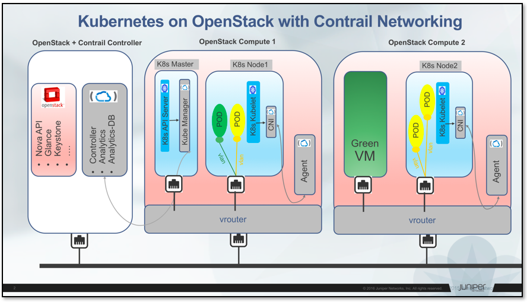
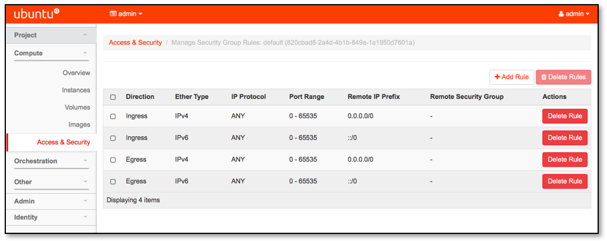
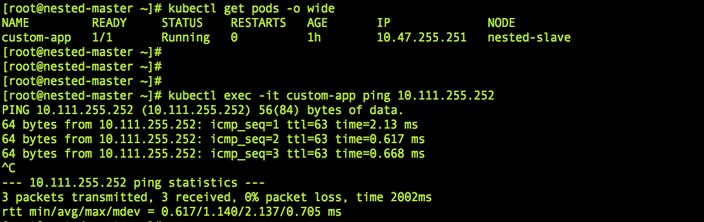

# Nested Mode (Contrail Networking)

## Overview

* Run Kubernetes/OpenShift container orchestration platforms on OpenStack
* One SDN controller to manage Container/VM/BareMetal workloads
* Simplified install through Heat orchestration engine

## Architecture

## Getting started

### Prerequisites

* [Contrail-Cloud 4.X](https://www.juniper.net/support/downloads/?p=contrail#sw)

* [Contrail-Server-Manager](https://www.juniper.net/support/downloads/?p=contrail#sw)

* [CentOS-7.3-minimal with kernel-devel/headers](http://10.84.5.120/cs-shared//images/centos-nested-image.img)

* TWO x86 servers

      CPUs:     32 (2 threads/core)
      RAM:      > 64 GB
      DISK:     > 500 GB

* Gateway (Juniper MX) for Internet connectivity / FIP

### Install

#### CONTRAIL CLOUD

* Install Contrail-Cloud (Liberty/Mitaka/Newton) using Contrail-Server-Manager

      (openstack-controller)# > /etc/apt/sources.list
      (openstack-controller)# dpkg –i <contrail-server-manager-installer_4.0.0.0-<build-number><sku>_all.deb>
      
* Populate the testbed. Refer to [example-file](https://github.com/savithruml/nested-mode-contrail-networking/tree/master/examples/testbed.py) & provision the cluster

      (openstack-controller)# /opt/contrail/contrail_server_manager/provision_containers.sh -t <testbed.py path> -c <contrail-cloud-docker.tgz> --cluster-id <user-defined-cluster-name> -d <domain-name> --no-sm-webui
      
* Monitor status

      (openstack-controller)# /opt/contrail/contrail_server_manager/provision_status.sh
      
* After provision completes, check if all services are up & running

      (all-nodes)# contrail-status
      
* Create a public virtual-network & launch a virtual-machine in the VN

* Verify it can talk to the outside world

      (virtual-machine)# ping 8.8.8.8

#### NESTED KUBERNETES      

* Download the CentOS image & upload it to glance

      (openstack-controller)# wget http://10.84.5.120/cs-shared//images/centos-nested-image.img
      (openstack-controller)# glance image-create --name centos-nested-image --visibility=public --container-format ovf --disk-format qcow2 --file centos-nested-image.img
      
* Clone this [repo](https://github.com/savithruml/nested-mode-contrail-networking)

      (openstack-controller)# git clone https://github.com/savithruml/nested-mode-contrail-networking

* Populate the environment file

      (openstack-controller)# vi /root/nested-mode-contrail-networking/provisioning/heat/deploy-nested.env
      
  Refer to [example-file](https://github.com/savithruml/nested-mode-contrail-networking/blob/master/examples/example-nested-k8s.env)
  
* Create the heat stack

      (openstack-controller)# cd nested-mode-contrail-networking/provisioning/heat/
      (openstack-controller)# heat stack-create nested -f deploy-nested.yaml -e deploy-nested.env
      
* Monitor the status

      (openstack-controller)# heat stack-list
      (openstack-controller)# heat stack-show nested

* Get the master/slave IP

      (openstack-controller)# heat stack-show nested | grep "output_"
  
  Login to nova-instances & tail on init logs for status
  
      (overcloud-nested-nodes)# tail -f /var/log/cloud-init-output.log -f /var/log/cloud-init.log -f /var/log/messages

* Once installation is complete, create Kubernetes dashboard

      (overcloud-nested-master)# kubectl create -f /root/k8s-dashboard.yml
      
* Open browser & navigate to _http://nested-slave-ip:9090_

     
      
* Launch a pod (container) in the public virtual-network

      (overcloud-nested-master)# kubectl create -f /root/custom-app.yml
      (overcloud-nested-master)# kubectl get pods

     
      
* Once the pod is up, launch a virtual-machine (OpenStack Horizon) in the public virtual-network

     

  **NOTE**: Edit _default_ security-group to allow ICMP traffic 

     

* Once the virtual-machine is up, ping the virtual-machine from the pod

      (overcloud-nested-master)# kubectl exec -it custom-app ping <VM-IP>      

     

#### NESTED OPENSHIFT

            <Work in progress>

### Uninstall

* Delete contrail-objects
            
            <Work in progress> 
            DO IT MANUALLY FOR NOW
    
* Delete stack
    
      (openstack-controller)# heat stack-delete nested -y

## Issues/Bugs/Feature-Requests

* [Raise it here](https://github.com/savithruml/nested-mode-contrail-networking/issues)
